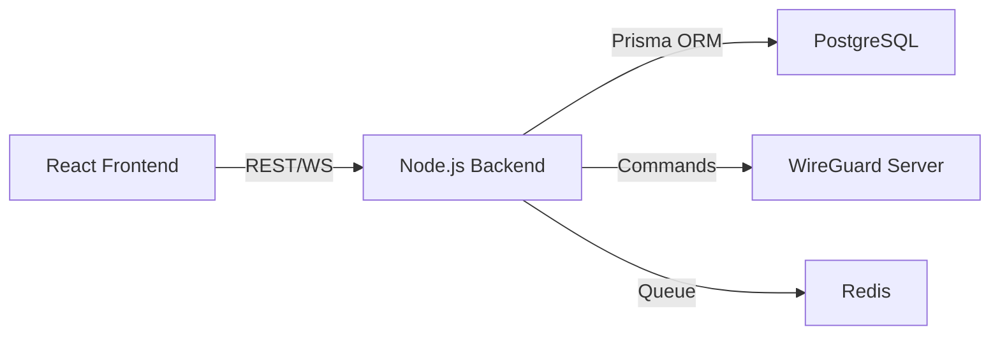
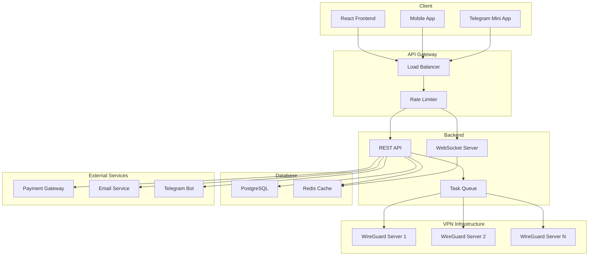
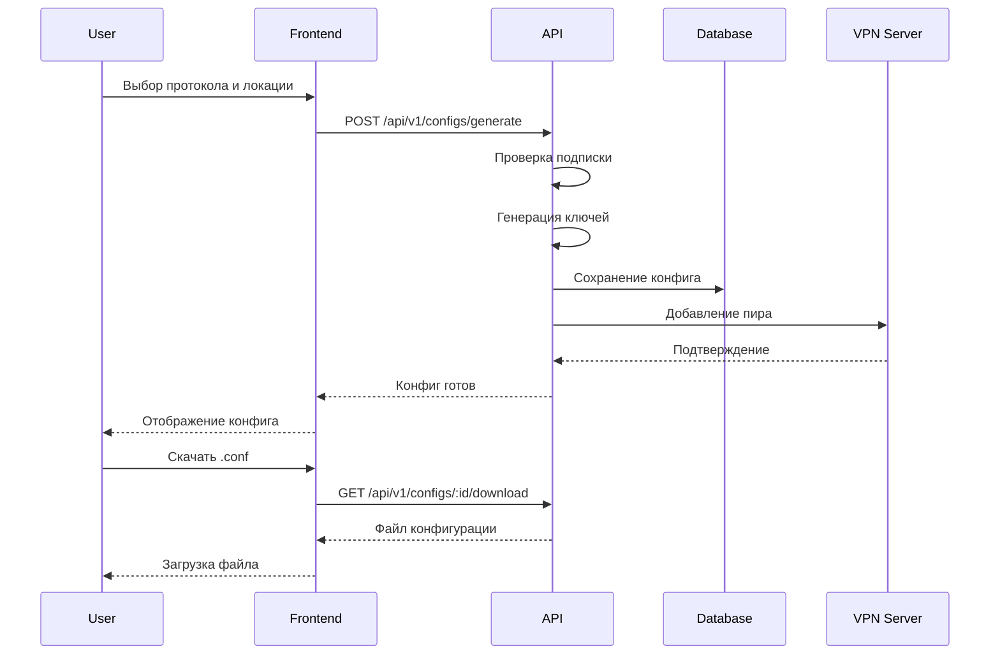
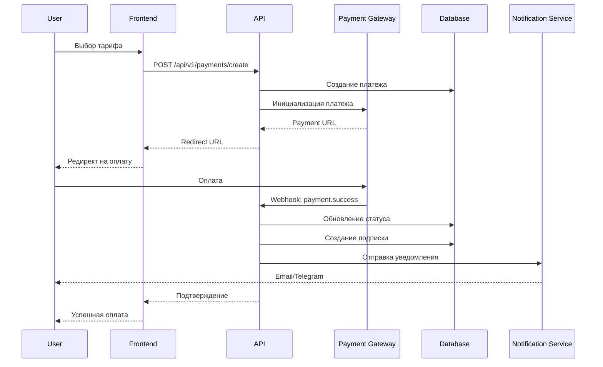

# NODE-1 VPN Platform - Development Roadmap

> **Версия**: 1.0  
> **Дата создания**: 27 января 2026  
> **Статус проекта**: Frontend Complete (Mock Data) → Backend Development Required

---

## 📋 Содержание

1. [Текущее состояние проекта](#текущее-состояние-проекта)
2. [Backend и API (ВЫСОКИЙ приоритет)](#1-backend-и-api)
3. [Функциональные улучшения (ВЫСОКИЙ приоритет)](#2-функциональные-улучшения)
4. [Технические улучшения (СРЕДНИЙ приоритет)](#3-технические-улучшения)
5. [UX/UI улучшения (СРЕДНИЙ приоритет)](#4-uxui-улучшения)
6. [Интеграции и расширения (НИЗКИЙ приоритет)](#5-интеграции-и-расширения)
7. [Безопасность (ВЫСОКИЙ приоритет)](#6-безопасность)
8. [Диаграммы архитектуры](#диаграммы-архитектуры)

---

## Текущее состояние проекта

### ✅ Реализовано

**Frontend (100%)**
- 12 маршрутов с полной навигацией
- 60+ React компонентов с TypeScript
- Киберпанк дизайн-система (Tailwind CSS + shadcn/ui)
- Визуальные эффекты: particles, holographic, glitch, 3D cards, data streams
- Генератор VPN-конфигураций (mock)
- Личный кабинет (UI only)
- Информационные страницы (NODE-1, Hardware, Infrastructure, FAQ)
- Система тарифов и pricing
- Адаптивный дизайн (mobile-first)

**Технологический стек**
- React 18.3.1 + TypeScript 5.8.3
- Vite 5.4.19
- React Router DOM 6.30.1
- Framer Motion 12.29.0 (анимации)
- TanStack Query 5.83.0 (готов к API)
- React Hook Form + Zod (валидация)
- shadcn/ui + Radix UI

### ❌ Не реализовано

- Backend API и база данных
- Реальное управление VPN-серверами
- Аутентификация и авторизация
- Платежная система
- Тестирование (только setup)
- CI/CD pipeline
- Мониторинг и логирование

---

## 1. Backend и API

**Приоритет**: 🔴 ВЫСОКИЙ  
**Зависимости**: Критично для всех остальных функций

### 1.1 Выбор технологического стека

#### Вариант A: Node.js + Express/Fastify (Рекомендуется)

**Преимущества**:
- Единый язык (TypeScript) для frontend и backend
- Быстрая разработка, большая экосистема
- Отличная интеграция с React
- Команда уже знакома с JavaScript/TypeScript

**Технологии**:
- **Runtime**: Node.js 20 LTS
- **Framework**: Fastify (высокая производительность) или Express (простота)
- **ORM**: Prisma (type-safe, миграции)
- **Validation**: Zod (общая схема с frontend)
- **WebSocket**: Socket.io или ws

**Сложность**: Средняя  
**Срок**: 3-4 недели



#### Вариант B: Python + FastAPI

**Преимущества**:
- Отличная работа с системными командами (WireGuard)
- Автоматическая документация API (OpenAPI)
- Async/await из коробки
- Сильная типизация (Pydantic)

**Технологии**:
- **Framework**: FastAPI
- **ORM**: SQLAlchemy 2.0 + Alembic
- **Validation**: Pydantic
- **WebSocket**: FastAPI WebSocket
- **Task Queue**: Celery + Redis

**Сложность**: Средняя  
**Срок**: 3-4 недели

#### Вариант C: Go + Fiber/Gin

**Преимущества**:
- Максимальная производительность
- Низкое потребление ресурсов
- Отличная работа с сетевыми протоколами
- Встроенная конкурентность

**Технологии**:
- **Framework**: Fiber или Gin
- **ORM**: GORM
- **WebSocket**: Gorilla WebSocket

**Сложность**: Высокая (новый язык для команды)  
**Срок**: 5-6 недель

---

### 1.2 REST API Endpoints

#### Аутентификация

```typescript
POST   /api/v1/auth/register          // Регистрация
POST   /api/v1/auth/login             // Вход
POST   /api/v1/auth/logout            // Выход
POST   /api/v1/auth/refresh           // Обновление токена
POST   /api/v1/auth/telegram          // Telegram Login
GET    /api/v1/auth/me                // Текущий пользователь
```

#### Пользователи

```typescript
GET    /api/v1/users/:id              // Профиль пользователя
PATCH  /api/v1/users/:id              // Обновление профиля
DELETE /api/v1/users/:id              // Удаление аккаунта
GET    /api/v1/users/:id/subscriptions // Подписки пользователя
```

#### VPN Конфигурации

```typescript
POST   /api/v1/configs/generate       // Генерация конфига
GET    /api/v1/configs                // Список конфигов
GET    /api/v1/configs/:id            // Детали конфига
DELETE /api/v1/configs/:id            // Удаление конфига
GET    /api/v1/configs/:id/download   // Скачать .conf файл
GET    /api/v1/configs/:id/qr         // QR-код конфига
```

#### Подключения

```typescript
GET    /api/v1/connections            // Активные подключения
GET    /api/v1/connections/:id/stats  // Статистика подключения
POST   /api/v1/connections/:id/disconnect // Отключить
```

#### Серверы и локации

```typescript
GET    /api/v1/servers                // Список серверов
GET    /api/v1/servers/:id            // Детали сервера
GET    /api/v1/servers/:id/status     // Статус сервера
GET    /api/v1/locations              // Доступные локации
```

#### Подписки и тарифы

```typescript
GET    /api/v1/plans                  // Тарифные планы
POST   /api/v1/subscriptions          // Создать подписку
GET    /api/v1/subscriptions/:id      // Детали подписки
PATCH  /api/v1/subscriptions/:id      // Обновить подписку
DELETE /api/v1/subscriptions/:id      // Отменить подписку
```

#### Платежи

```typescript
POST   /api/v1/payments/create        // Создать платеж
GET    /api/v1/payments/:id           // Статус платежа
POST   /api/v1/payments/:id/confirm   // Подтвердить платеж
GET    /api/v1/payments/history       // История платежей
```

#### Администрирование

```typescript
GET    /api/v1/admin/users            // Управление пользователями
GET    /api/v1/admin/servers          // Управление серверами
GET    /api/v1/admin/analytics        // Аналитика
POST   /api/v1/admin/servers/:id/restart // Перезапуск сервера
```

**Сложность**: Средняя  
**Срок**: 2-3 недели  
**Зависимости**: Выбор backend стека

---

### 1.3 WebSocket для Real-Time

**Функционал**:
- Статус подключения (online/offline)
- Статистика трафика в реальном времени
- Уведомления о событиях
- Мониторинг серверов

**События**:
```typescript
// Client → Server
ws.emit('subscribe:connection', { connectionId })
ws.emit('subscribe:server', { serverId })

// Server → Client
ws.on('connection:status', { status, timestamp })
ws.on('connection:stats', { bytesIn, bytesOut, latency })
ws.on('server:status', { serverId, status, load })
ws.on('notification', { type, message, data })
```

**Технологии**:
- Socket.io (Node.js) или FastAPI WebSocket (Python)
- Redis Pub/Sub для масштабирования

**Сложность**: Средняя  
**Срок**: 1-2 недели  
**Зависимости**: Backend API

---

### 1.4 База данных

#### Схема PostgreSQL

```sql
-- Пользователи
CREATE TABLE users (
  id UUID PRIMARY KEY DEFAULT gen_random_uuid(),
  email VARCHAR(255) UNIQUE NOT NULL,
  username VARCHAR(100) UNIQUE,
  password_hash VARCHAR(255),
  telegram_id BIGINT UNIQUE,
  role VARCHAR(20) DEFAULT 'user', -- user, admin
  created_at TIMESTAMP DEFAULT NOW(),
  updated_at TIMESTAMP DEFAULT NOW()
);

-- Подписки
CREATE TABLE subscriptions (
  id UUID PRIMARY KEY DEFAULT gen_random_uuid(),
  user_id UUID REFERENCES users(id) ON DELETE CASCADE,
  plan_id UUID REFERENCES plans(id),
  status VARCHAR(20) DEFAULT 'active', -- active, expired, cancelled
  started_at TIMESTAMP DEFAULT NOW(),
  expires_at TIMESTAMP NOT NULL,
  auto_renew BOOLEAN DEFAULT true,
  created_at TIMESTAMP DEFAULT NOW()
);

-- Тарифные планы
CREATE TABLE plans (
  id UUID PRIMARY KEY DEFAULT gen_random_uuid(),
  name VARCHAR(100) NOT NULL,
  description TEXT,
  price DECIMAL(10,2) NOT NULL,
  duration_days INTEGER NOT NULL,
  max_devices INTEGER DEFAULT 5,
  bandwidth_limit BIGINT, -- bytes, NULL = unlimited
  features JSONB,
  is_active BOOLEAN DEFAULT true,
  created_at TIMESTAMP DEFAULT NOW()
);

-- VPN конфигурации
CREATE TABLE vpn_configs (
  id UUID PRIMARY KEY DEFAULT gen_random_uuid(),
  user_id UUID REFERENCES users(id) ON DELETE CASCADE,
  subscription_id UUID REFERENCES subscriptions(id),
  protocol VARCHAR(20) NOT NULL, -- wireguard, amnezia
  server_id UUID REFERENCES servers(id),
  private_key TEXT NOT NULL,
  public_key TEXT NOT NULL,
  ip_address INET NOT NULL,
  name VARCHAR(100),
  is_active BOOLEAN DEFAULT true,
  created_at TIMESTAMP DEFAULT NOW(),
  last_used_at TIMESTAMP
);

-- Серверы
CREATE TABLE servers (
  id UUID PRIMARY KEY DEFAULT gen_random_uuid(),
  name VARCHAR(100) NOT NULL,
  location_code VARCHAR(10) NOT NULL, -- AMS, FRA, etc.
  location_name VARCHAR(100) NOT NULL,
  country_code VARCHAR(2) NOT NULL,
  ip_address INET NOT NULL,
  port INTEGER DEFAULT 51820,
  protocol VARCHAR(20) NOT NULL,
  capacity INTEGER DEFAULT 1000,
  current_load INTEGER DEFAULT 0,
  status VARCHAR(20) DEFAULT 'active', -- active, maintenance, offline
  created_at TIMESTAMP DEFAULT NOW()
);

-- Подключения (логи)
CREATE TABLE connections (
  id UUID PRIMARY KEY DEFAULT gen_random_uuid(),
  config_id UUID REFERENCES vpn_configs(id) ON DELETE CASCADE,
  server_id UUID REFERENCES servers(id),
  connected_at TIMESTAMP DEFAULT NOW(),
  disconnected_at TIMESTAMP,
  bytes_sent BIGINT DEFAULT 0,
  bytes_received BIGINT DEFAULT 0,
  duration_seconds INTEGER
);

-- Платежи
CREATE TABLE payments (
  id UUID PRIMARY KEY DEFAULT gen_random_uuid(),
  user_id UUID REFERENCES users(id) ON DELETE CASCADE,
  subscription_id UUID REFERENCES subscriptions(id),
  amount DECIMAL(10,2) NOT NULL,
  currency VARCHAR(3) DEFAULT 'USD',
  payment_method VARCHAR(50), -- crypto, stripe, yoomoney
  status VARCHAR(20) DEFAULT 'pending', -- pending, completed, failed
  transaction_id VARCHAR(255),
  metadata JSONB,
  created_at TIMESTAMP DEFAULT NOW(),
  completed_at TIMESTAMP
);

-- Индексы для производительности
CREATE INDEX idx_users_email ON users(email);
CREATE INDEX idx_users_telegram ON users(telegram_id);
CREATE INDEX idx_subscriptions_user ON subscriptions(user_id);
CREATE INDEX idx_subscriptions_status ON subscriptions(status);
CREATE INDEX idx_configs_user ON vpn_configs(user_id);
CREATE INDEX idx_connections_config ON connections(config_id);
CREATE INDEX idx_payments_user ON payments(user_id);
```

**Технологии**:
- PostgreSQL 15+ (основная БД)
- Redis 7+ (кэш, сессии, очереди)
- Prisma/SQLAlchemy (ORM)

**Сложность**: Средняя  
**Срок**: 1 неделя  
**Зависимости**: Backend стек

---

### 1.5 Интеграция с WireGuard/AmneziaWG

#### Управление WireGuard

**Задачи**:
1. Генерация ключевых пар (приватный/публичный)
2. Создание конфигурационных файлов
3. Добавление/удаление пиров на сервере
4. Мониторинг подключений
5. Сбор статистики трафика

**Технологии**:
- `wg` CLI утилита (WireGuard)
- `awg` CLI утилита (AmneziaWG)
- SSH для удаленного управления серверами
- Systemd для управления сервисами

**Пример кода (Node.js)**:
```typescript
import { exec } from 'child_process';
import { promisify } from 'util';

const execAsync = promisify(exec);

class WireGuardManager {
  async generateKeyPair() {
    const privateKey = await execAsync('wg genkey');
    const publicKey = await execAsync(`echo "${privateKey}" | wg pubkey`);
    return { privateKey: privateKey.trim(), publicKey: publicKey.trim() };
  }

  async addPeer(serverId: string, publicKey: string, ipAddress: string) {
    const cmd = `wg set wg0 peer ${publicKey} allowed-ips ${ipAddress}/32`;
    await this.executeOnServer(serverId, cmd);
  }

  async removePeer(serverId: string, publicKey: string) {
    const cmd = `wg set wg0 peer ${publicKey} remove`;
    await this.executeOnServer(serverId, cmd);
  }

  async getStats(serverId: string) {
    const { stdout } = await this.executeOnServer(serverId, 'wg show wg0 dump');
    return this.parseWgDump(stdout);
  }
}
```

**Сложность**: Высокая  
**Срок**: 2-3 недели  
**Зависимости**: Backend API, серверная инфраструктура

---

## 2. Функциональные улучшения

**Приоритет**: 🔴 ВЫСОКИЙ

### 2.1 Система аутентификации

#### JWT Authentication

**Функционал**:
- Регистрация по email + пароль
- Вход с JWT токенами (access + refresh)
- Защищенные маршруты
- Автоматическое обновление токенов

**Технологии**:
- jsonwebtoken (Node.js) или PyJWT (Python)
- bcrypt для хеширования паролей
- HTTP-only cookies для refresh токенов

**Сложность**: Простая  
**Срок**: 3-5 дней

#### OAuth 2.0 (Google, GitHub)

**Функционал**:
- Вход через Google
- Вход через GitHub
- Связывание аккаунтов

**Технологии**:
- Passport.js (Node.js) или Authlib (Python)
- OAuth 2.0 providers

**Сложность**: Средняя  
**Срок**: 1 неделя

#### Telegram Login Widget

**Функционал**:
- Вход через Telegram (без пароля)
- Верификация через Telegram Bot API
- Связывание с существующим аккаунтом

**Технологии**:
- Telegram Login Widget
- Telegram Bot API
- Crypto для верификации подписи

**Сложность**: Простая  
**Срок**: 2-3 дня

**Зависимости**: Backend API

---

### 2.2 Управление подписками и лицензиями

**Функционал**:
- Создание/продление подписки
- Автоматическое продление
- Уведомления об истечении
- История подписок
- Управление устройствами (лимит)
- Заморозка подписки

**Технологии**:
- Cron jobs или Task Scheduler
- Email/Telegram уведомления

**Сложность**: Средняя  
**Срок**: 1-2 недели  
**Зависимости**: Backend API, платежная система

---

### 2.3 Платежная интеграция

#### Cryptocurrency Payments

**Функционал**:
- Прием BTC, ETH, USDT, TON
- Генерация уникальных адресов
- Автоматическое подтверждение платежей
- Конвертация в USD/RUB

**Технологии**:
- **CryptoCloud** (рекомендуется для РФ)
- **NOWPayments** (глобальный)
- **CoinPayments**
- **TON Connect** (для TON)

**Сложность**: Средняя  
**Срок**: 1-2 недели

#### Stripe (карты)

**Функционал**:
- Прием карт Visa/Mastercard
- Подписки с автоплатежами
- 3D Secure

**Технологии**:
- Stripe API
- Stripe Elements (frontend)

**Сложность**: Простая  
**Срок**: 3-5 дней

#### ЮMoney (для РФ)

**Функционал**:
- Прием платежей в рублях
- Карты, кошельки, СБП

**Технологии**:
- ЮMoney API

**Сложность**: Простая  
**Срок**: 3-5 дней

**Зависимости**: Backend API

---

### 2.4 Мониторинг и аналитика

#### Пользовательская аналитика

**Метрики**:
- Активные пользователи (DAU/MAU)
- Новые регистрации
- Конверсия в платящих
- Churn rate
- LTV (Lifetime Value)

**Технологии**:
- Google Analytics 4
- Mixpanel или Amplitude
- Custom dashboard (Recharts)

**Сложность**: Простая  
**Срок**: 1 неделя

#### Техническая аналитика

**Метрики**:
- Статус серверов (uptime)
- Нагрузка на серверы
- Трафик (bandwidth)
- Количество подключений
- Ошибки и инциденты

**Технологии**:
- Prometheus + Grafana
- Custom API endpoints

**Сложность**: Средняя  
**Срок**: 1-2 недели

**Зависимости**: Backend API

---

### 2.5 Система уведомлений

#### Email уведомления

**События**:
- Регистрация (welcome email)
- Подтверждение email
- Создание подписки
- Истечение подписки (за 7, 3, 1 день)
- Успешный платеж
- Проблемы с платежом

**Технологии**:
- SendGrid или Mailgun
- React Email для шаблонов

**Сложность**: Простая  
**Срок**: 3-5 дней

#### Telegram уведомления

**События**:
- Все события из email
- Статус подключения
- Превышение лимита трафика

**Технологии**:
- Telegram Bot API
- Telegram Notifications

**Сложность**: Простая  
**Срок**: 2-3 дня

#### Push уведомления (PWA)

**События**:
- Критические уведомления
- Истечение подписки

**Технологии**:
- Web Push API
- Service Workers

**Сложность**: Средняя  
**Срок**: 1 неделя

**Зависимости**: Backend API

---

## 3. Технические улучшения

**Приоритет**: 🟡 СРЕДНИЙ

### 3.1 Тестирование

#### Unit тесты

**Покрытие**:
- Утилиты и хелперы
- Бизнес-логика
- API endpoints
- Валидация данных

**Технологии**:
- Vitest (frontend)
- Jest или Vitest (backend)
- Testing Library

**Цель**: 80%+ покрытие  
**Сложность**: Средняя  
**Срок**: 2-3 недели

#### Integration тесты

**Покрытие**:
- API endpoints
- База данных
- Аутентификация
- Платежи

**Технологии**:
- Supertest (Node.js)
- Pytest (Python)
- Testcontainers (Docker)

**Сложность**: Средняя  
**Срок**: 2 недели

#### E2E тесты

**Сценарии**:
- Регистрация → Покупка → Генерация конфига
- Вход → Управление подпиской
- Админ-панель

**Технологии**:
- Playwright или Cypress

**Сложность**: Средняя  
**Срок**: 1-2 недели

**Зависимости**: Backend API

---

### 3.2 CI/CD Pipeline

#### GitHub Actions

**Этапы**:
1. **Lint & Format**: ESLint, Prettier
2. **Type Check**: TypeScript
3. **Test**: Unit + Integration
4. **Build**: Production build
5. **Deploy**: Staging → Production

**Конфигурация**:
```yaml
name: CI/CD

on:
  push:
    branches: [main, develop]
  pull_request:
    branches: [main]

jobs:
  test:
    runs-on: ubuntu-latest
    steps:
      - uses: actions/checkout@v3
      - uses: actions/setup-node@v3
      - run: npm ci
      - run: npm run lint
      - run: npm run type-check
      - run: npm test
      
  build:
    needs: test
    runs-on: ubuntu-latest
    steps:
      - uses: actions/checkout@v3
      - run: npm ci
      - run: npm run build
      
  deploy:
    needs: build
    runs-on: ubuntu-latest
    if: github.ref == 'refs/heads/main'
    steps:
      - name: Deploy to production
        run: ./deploy.sh
```

**Сложность**: Простая  
**Срок**: 2-3 дня

---

### 3.3 Docker контейнеризация

#### Docker Compose

**Сервисы**:
- Frontend (Nginx)
- Backend (Node.js/Python)
- PostgreSQL
- Redis
- WireGuard (отдельный контейнер)

**Пример docker-compose.yml**:
```yaml
version: '3.8'

services:
  frontend:
    build: ./frontend
    ports:
      - "80:80"
    depends_on:
      - backend
      
  backend:
    build: ./backend
    ports:
      - "3000:3000"
    environment:
      DATABASE_URL: postgresql://user:pass@db:5432/vpn
      REDIS_URL: redis://redis:6379
    depends_on:
      - db
      - redis
      
  db:
    image: postgres:15-alpine
    volumes:
      - postgres_data:/var/lib/postgresql/data
    environment:
      POSTGRES_DB: vpn
      POSTGRES_USER: user
      POSTGRES_PASSWORD: pass
      
  redis:
    image: redis:7-alpine
    volumes:
      - redis_data:/data

volumes:
  postgres_data:
  redis_data:
```

**Сложность**: Средняя  
**Срок**: 1 неделя

---

### 3.4 Мониторинг и логирование

#### Application Monitoring

**Технологии**:
- **Sentry** (error tracking)
- **LogRocket** (session replay)
- **Datadog** или **New Relic** (APM)

**Сложность**: Простая  
**Срок**: 2-3 дня

#### Logging

**Технологии**:
- Winston (Node.js) или Loguru (Python)
- ELK Stack (Elasticsearch, Logstash, Kibana)
- Loki + Grafana (легковесная альтернатива)

**Сложность**: Средняя  
**Срок**: 1 неделя

#### Infrastructure Monitoring

**Технологии**:
- Prometheus + Grafana
- Node Exporter
- WireGuard Exporter

**Метрики**:
- CPU, RAM, Disk usage
- Network traffic
- Active connections
- Response times

**Сложность**: Средняя  
**Срок**: 1-2 недели

---

### 3.5 Оптимизация производительности

#### Frontend оптимизации

**Задачи**:
- Code splitting (React.lazy)
- Image optimization (WebP, lazy loading)
- Bundle size reduction
- Lighthouse score 90+
- Кэширование API запросов

**Технологии**:
- Vite build optimization
- React.memo, useMemo, useCallback
- TanStack Query caching

**Сложность**: Средняя  
**Срок**: 1 неделя

#### Backend оптимизации

**Задачи**:
- Database query optimization (индексы)
- Redis caching
- Connection pooling
- Rate limiting
- Compression (gzip/brotli)

**Сложность**: Средняя  
**Срок**: 1-2 недели

---

## 4. UX/UI улучшения

**Приоритет**: 🟡 СРЕДНИЙ

### 4.1 Новые страницы и функции

#### Расширенная админ-панель

**Функционал**:
- Управление пользователями (блокировка, удаление)
- Управление серверами (добавление, настройка)
- Мониторинг в реальном времени
- Финансовая аналитика
- Логи и аудит

**Сложность**: Высокая  
**Срок**: 3-4 недели

#### Страница статистики пользователя

**Функционал**:
- Графики трафика (день/неделя/месяц)
- История подключений
- Топ используемых серверов
- Средняя скорость

**Технологии**:
- Recharts для графиков
- TanStack Query для данных

**Сложность**: Средняя  
**Срок**: 1 неделя

#### Страница поддержки

**Функционал**:
- Тикет-система
- База знаний (FAQ расширенный)
- Чат с поддержкой (опционально)

**Сложность**: Средняя  
**Срок**: 2 недели

#### Реферальная программа

**Функционал**:
- Уникальная реферальная ссылка
- Отслеживание рефералов
- Бонусы за приглашения
- Статистика рефералов

**Сложность**: Средняя  
**Срок**: 1-2 недели

---

### 4.2 Улучшение существующих компонентов

#### Генератор конфигураций

**Улучшения**:
- Предпросмотр конфига перед генерацией
- Выбор DNS серверов (1.1.1.1, 8.8.8.8, custom)
- Настройка MTU
- Kill Switch опция
- Экспорт в разных форматах (QR, JSON, plain text)

**Сложность**: Простая  
**Срок**: 3-5 дней

#### Dashboard

**Улучшения**:
- Виджет быстрого подключения
- Карта серверов (интерактивная)
- Уведомления в реальном времени
- Быстрые действия (переключение сервера)

**Сложность**: Средняя  
**Срок**: 1 неделя

#### Pricing страница

**Улучшения**:
- Калькулятор стоимости
- Сравнение тарифов (таблица)
- Промокоды и скидки
- Тестовый период (trial)

**Сложность**: Простая  
**Срок**: 3-5 дней

---

### 4.3 Accessibility (A11y)

**Задачи**:
- ARIA labels для всех интерактивных элементов
- Keyboard navigation
- Screen reader support
- Контрастность цветов (WCAG AA)
- Focus indicators

**Технологии**:
- axe DevTools
- WAVE
- Lighthouse accessibility audit

**Сложность**: Средняя  
**Срок**: 1-2 недели

---

### 4.4 Интернационализация (i18n)

**Языки**:
- Русский (основной)
- Английский
- Китайский (опционально)

**Технологии**:
- react-i18next
- i18next

**Сложность**: Средняя  
**Срок**: 1-2 недели

---

### 4.5 PWA функционал

**Функционал**:
- Установка как приложение
- Offline режим (базовый)
- Push уведомления
- App shortcuts

**Технологии**:
- Vite PWA Plugin
- Workbox
- Web App Manifest

**Сложность**: Средняя  
**Срок**: 1 неделя

---

## 5. Интеграции и расширения

**Приоритет**: 🟢 НИЗКИЙ

### 5.1 Telegram Mini App

**Функционал**:
- Просмотр статуса подписки
- Быстрое подключение
- Генерация конфигов
- Уведомления
- Платежи через Telegram Stars

**Технологии**:
- Telegram Mini Apps SDK
- React (переиспользование компонентов)

**Сложность**: Средняя  
**Срок**: 2-3 недели

---

### 5.2 Мобильные приложения

#### React Native

**Функционал**:
- Полный функционал веб-версии
- Нативное управление VPN
- Push уведомления
- Биометрическая аутентификация

**Платформы**: iOS, Android

**Сложность**: Высокая  
**Срок**: 2-3 месяца

---

### 5.3 Браузерные расширения

**Функционал**:
- Быстрое включение/выключение VPN
- Выбор сервера
- Статистика трафика
- Proxy для браузера

**Браузеры**: Chrome, Firefox, Edge

**Технологии**:
- WebExtensions API
- React (popup UI)

**Сложность**: Средняя  
**Срок**: 3-4 недели

---

### 5.4 API для партнеров

**Функционал**:
- Создание подписок
- Управление пользователями
- Получение статистики
- Webhook уведомления

**Технологии**:
- REST API
- API Keys
- Rate limiting

**Сложность**: Средняя  
**Срок**: 2-3 недели

---

### 5.5 Affiliate программа

**Функционал**:
- Партнерские ссылки
- Отслеживание конверсий
- Комиссионные выплаты
- Партнерский кабинет

**Сложность**: Высокая  
**Срок**: 3-4 недели

---

## 6. Безопасность

**Приоритет**: 🔴 ВЫСОКИЙ

### 6.1 Аудит безопасности

**Задачи**:
- Penetration testing
- Code review (security focus)
- Dependency audit (npm audit, Snyk)
- OWASP Top 10 compliance

**Сложность**: Высокая  
**Срок**: 2-3 недели

---

### 6.2 Rate Limiting

**Защита от**:
- Brute force атак
- DDoS атак
- API abuse

**Технологии**:
- express-rate-limit (Node.js)
- slowapi (Python)
- Redis для distributed rate limiting

**Лимиты**:
- Login: 5 попыток / 15 минут
- API: 100 запросов / минуту
- Config generation: 10 / час

**Сложность**: Простая  
**Срок**: 2-3 дня

---

### 6.3 DDoS защита

**Технологии**:
- Cloudflare (рекомендуется)
- AWS Shield
- Nginx rate limiting

**Сложность**: Простая  
**Срок**: 1-2 дня

---

### 6.4 Шифрование данных

**Задачи**:
- HTTPS (SSL/TLS сертификаты)
- Шифрование паролей (bcrypt)
- Шифрование приватных ключей в БД
- Шифрование чувствительных данных (AES-256)

**Технологии**:
- Let's Encrypt (SSL)
- bcrypt
- crypto (Node.js) или cryptography (Python)

**Сложность**: Средняя  
**Срок**: 1 неделя

---

### 6.5 Compliance

#### GDPR (для ЕС)

**Требования**:
- Согласие на обработку данных
- Право на удаление данных
- Право на экспорт данных
- Privacy Policy

**Сложность**: Средняя  
**Срок**: 1-2 недели

#### Логирование без PII

**Задачи**:
- Анонимизация IP адресов
- Минимизация хранения личных данных
- Автоматическое удаление старых логов

**Сложность**: Простая  
**Срок**: 3-5 дней

---

## Диаграммы архитектуры

### Общая архитектура системы



### Процесс генерации VPN конфигурации



### Процесс оплаты и активации подписки



---

## Приоритизация задач

### Фаза 1: MVP Backend (4-6 недель)

1. ✅ Выбор backend стека (Node.js рекомендуется)
2. ✅ Настройка базы данных (PostgreSQL + Redis)
3. ✅ REST API (аутентификация, пользователи, конфиги)
4. ✅ Интеграция с WireGuard
5. ✅ Базовая платежная интеграция (crypto)
6. ✅ Деплой на staging

### Фаза 2: Полнофункциональная платформа (6-8 недель)

1. ✅ WebSocket для real-time
2. ✅ Система подписок
3. ✅ Уведомления (email + Telegram)
4. ✅ Мониторинг и аналитика
5. ✅ Админ-панель
6. ✅ Тестирование (unit + integration)
7. ✅ CI/CD pipeline
8. ✅ Production деплой

### Фаза 3: Улучшения и расширения (8-12 недель)

1. ✅ PWA функционал
2. ✅ Интернационализация
3. ✅ Telegram Mini App
4. ✅ Реферальная программа
5. ✅ Расширенная аналитика
6. ✅ E2E тесты
7. ✅ Оптимизация производительности

### Фаза 4: Масштабирование (опционально)

1. ✅ Мобильные приложения (React Native)
2. ✅ Браузерные расширения
3. ✅ API для партнеров
4. ✅ Affiliate программа
5. ✅ Дополнительные платежные методы

---

## Оценка ресурсов

### Команда (рекомендуемая)

- **1 Backend Developer** (Node.js/Python)
- **1 Frontend Developer** (React/TypeScript) - уже есть
- **1 DevOps Engineer** (part-time)
- **1 QA Engineer** (part-time)

### Инфраструктура (месячные затраты)

- **VPS серверы** (3-5 локаций): $50-100/месяц
- **Database hosting** (managed PostgreSQL): $20-50/месяц
- **CDN** (Cloudflare): $0-20/месяц
- **Monitoring** (Sentry, Datadog): $0-50/месяц
- **Email service** (SendGrid): $0-15/месяц

**Итого**: $70-235/месяц (зависит от нагрузки)

---

## Риски и митигация

| Риск | Вероятность | Влияние | Митигация |
|------|-------------|---------|-----------|
| Проблемы с WireGuard интеграцией | Средняя | Высокое | Прототипирование на ранней стадии |
| Блокировка платежных систем | Высокая | Высокое | Множественные провайдеры (crypto приоритет) |
| DDoS атаки | Средняя | Высокое | Cloudflare, rate limiting |
| Утечка данных | Низкая | Критическое | Аудит безопасности, шифрование |
| Масштабирование БД | Низкая | Среднее | Индексы, кэширование, read replicas |

---

## Заключение

Данный roadmap представляет собой комплексный план развития проекта NODE-1 VPN от текущего состояния (frontend на mock-данных) до полнофункциональной production-ready платформы.

**Ключевые рекомендации**:

1. **Начать с Backend MVP** (Фаза 1) - критично для всех остальных функций
2. **Приоритет безопасности** - внедрять с самого начала, не откладывать
3. **Итеративная разработка** - выпускать функции постепенно, собирать feedback
4. **Автоматизация** - CI/CD и тесты с ранних этапов
5. **Мониторинг** - внедрить сразу после первого деплоя

**Следующие шаги**:

1. ✅ Утвердить roadmap с командой
2. ✅ Выбрать backend стек (рекомендация: Node.js + TypeScript)
3. ✅ Настроить инфраструктуру (VPS, БД)
4. ✅ Начать разработку Backend MVP
5. ✅ Параллельно: настроить CI/CD и мониторинг

---

**Документ создан**: 27 января 2026  
**Версия**: 1.0  
**Автор**: Architect Mode  
**Статус**: Готов к обсуждению и утверждению
